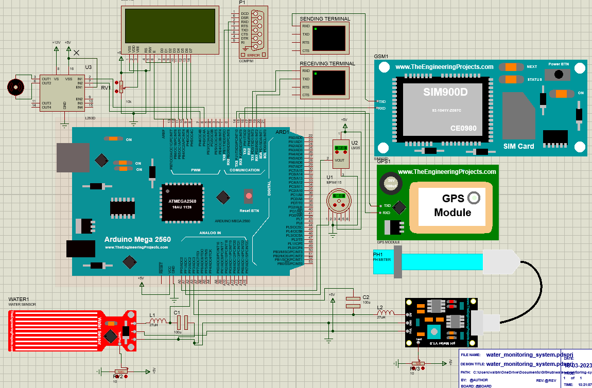

# Water Monitoring System
Herein I have developed a water pipe monitoring system.

## What It Can Do?
It checks the pipe's water flow rate, pressure of water, pH value as well as temperature of the water flowing through the pipe. The statistics of the pipe are visible on the LCD screen attached with it and also on the blynk app. It can send an SOS to the municipality in case the there is damage in the pipe i.e. indicated when the data is not within a specified range. It uses arduino based USB serial to connect to the blynk app as well as the blynk dashboard.

## Arduino Components Used
None as it is software based simulation and the libraries of these components can be downloaded from the web or found in the proteus device library.
```
Arduino Mega 2560, COMPIM, SIM900D, 16x2 LCD Display, GPS Module, PH Sensor, Water Flow Sensor,
LM35, LM044L, POT-HG, MPX4115, Motors and L298N Motor Driver, Capacitors, Inductors
```
## Screenshots


